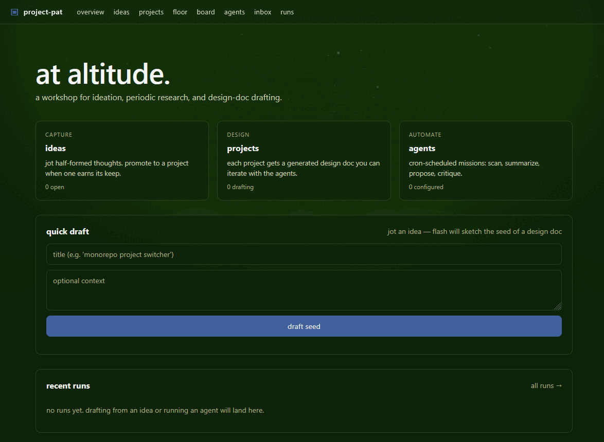

# project-pat




a single-user workshop for ideation, periodic research, and design-doc drafting — htmx-over-go with multi-provider LLM agents and a cron scheduler.

> **status**: scaffolding, but the loop is closed: ideas → projects → drafted/critiqued/reconciled design docs → workspace artifacts on disk → optional runnable prototype skeleton. Cron-scheduled agents and a manual run-now path feed the inbox; the workshop floor surfaces what's asking for attention.

## what's wired

- **`/`** — overview: counts + recent runs + streaming quick-draft form (creates an idea and seeds it via flash).
- **`/floor`** — *the workshop floor*. One tile per project, sorted by an attention score (empty doc, critique pending, unread inbox, staleness). Each tile shows the last paragraph of the doc, the last resolved decision, and a one-button next action.
- **`/ideas`** — capture pad; promote an idea to a project.
- **`/projects`** — project list; create from scratch or via promote. Archive/unarchive to keep the working set tight.
- **`/projects/:id`** — the heart of the workshop. Streaming panels for:
  - **design doc** — draft / refine via flash or pro
  - **team draft** — sequential planner → critic → drafter pro chain; intermediate plan + critic notes are persisted as artifacts; SSE `phase` events anchor the UI between passes
  - **scaffold prototype** — pro emits a JSON file manifest; the server sanitises paths and writes a runnable skeleton to `workspace/<slug>/proto/` (the workshop generates it; running it is up to you)
  - **critique** — pro critic produces a scorecard + numbered weaknesses + concrete edits; "apply critique" runs a second pro pass that refines the doc against those notes
  - **stack picker** — slot-by-slot tech-stack selector (runtime / framework / storage / deploy / …) with presets, version pins, and an incompat warning when runtime changes invalidate prior picks. Stack context is auto-injected into every project-scoped prompt
  - **devil's office hours** — pro "devil" reads the doc + latest critique + the resolved decisions and asks one sharp committing question; you answer ≤280 chars and the answer becomes a load-bearing decision in the prompt context of every later pass
  - **research brief** — pro brief with claims, counter-claims, open questions, and a parsed reading list. Items are an interactive checklist; per-item notes persist
  - **reconcile against notes** — once you've actually read some items, pro re-reads the brief through the lens of your per-item notes and emits a Confirmed / Complicated / New questions / Next moves reconciliation
  - **standing orders** — agents scoped to this project; their prompt is auto-templated with the live design doc on every run
  - **timeline** — recent runs touching the project (any trigger)
  - **materialize** — one click writes the current state (design doc, critique, brief + reading-list notes, reconcile, decisions, stack) to `workspace/<slug>/` as a set of Markdown files
- **`/agents`** — define cron-scheduled missions globally (or scope them via standing orders on a project). "run now" fires off-thread. Agent CRUD pings the scheduler in-process; new schedules are live within milliseconds, not 30 seconds.
- **`/board`** — your idea constellation. Click *cluster ideas* and a pro agent groups them into themes and emits weighted edges; the view renders as a 2D force-directed graph over the landscape. Click two nodes to select them and hit *synthesize* — pro writes a unified design doc for the combined project and you land on it.
- **`/inbox`** — agent reports (cron + manual) land here with unread badges, star, and a token-refined line diff vs the previous successful run by the same agent. Opening an item marks it read.
- **`/runs`** — full LLM run log with token usage, errors, and expandable rendered output.

All LLM endpoints stream over SSE; the UI shows tokens arriving in real-time, then swaps in rendered markdown when the stream ends. If the client disconnects mid-stream, the partial output is preserved in the run row (`status='cancelled'`) instead of being thrown away.

## run it

```bash
mise install                # installs a Go toolchain per mise.toml (or use any Go ≥ 1.26 directly)
go mod tidy
go run ./cmd/pat server    # or: just run
```

Then open <http://localhost:8080>. `just` (no args) lists the available recipes — `just repl`, `just build`, `just test`, `just check`, `just pat <subcommand>`.

There's also a CLI / REPL over the same DB — run `go run ./cmd/pat help` for the full list. Highlights:
```
pat ideas add "title" [body]    pat projects list [--archived]    pat projects materialize <id>
pat agents run <id>             pat inbox list [--unread]         pat repl
```
SQLite WAL lets the CLI and the server share the same db file safely.

Required `.env`:
```
# Generic LLM config (any OpenAI-compatible provider, or Anthropic):
LLM_PROVIDER=deepseek       # openai | deepseek | anthropic | openrouter | ollama | groq | together
LLM_API_KEY=sk-...          # falls back to DEEPSEEK_API_KEY / OPENAI_API_KEY / ANTHROPIC_API_KEY
# LLM_BASE_URL=...          # override base URL; each provider has a sensible default
# LLM_MODEL_FLASH=...       # tier 1: fast/cheap (per-provider default)
# LLM_MODEL_PRO=...         # tier 2: deeper/slower (per-provider default)
# LLM_REASONING_FLASH=off   # off | minimal | low | medium | high  (default: off)
# LLM_REASONING_PRO=medium  # off | minimal | low | medium | high  (default: medium)

# HTTP:
# HOST=0.0.0.0              # bind address; default 0.0.0.0 (LAN/Tailscale-reachable). Set to 127.0.0.1 to lock to localhost.
# PORT=8080
# DB_PATH=projectpat.db
```

The server binds on `0.0.0.0` by default — reachable on `http://localhost:8080`, your LAN IP, and your Tailscale IP. There's no auth (single-user tool), so don't expose it to the public internet without putting it behind a reverse proxy / VPN / SSH tunnel.

### Provider defaults

| provider     | base URL (default)                       | flash default              | pro default                  |
|--------------|------------------------------------------|----------------------------|------------------------------|
| `deepseek`   | `https://api.deepseek.com/v1`            | `deepseek-v4-flash`        | `deepseek-v4-pro`            |
| `openai`     | `https://api.openai.com/v1`              | `gpt-4o-mini`              | `gpt-4o`                     |
| `anthropic`  | `https://api.anthropic.com/v1`           | `claude-haiku-4-5-20251001`| `claude-opus-4-7`            |
| `openrouter` | `https://openrouter.ai/api/v1`           | _(set explicitly)_         | _(set explicitly)_           |
| `ollama`     | `http://localhost:11434/v1`              | _(set explicitly)_         | _(set explicitly)_           |
| `groq`       | `https://api.groq.com/openai/v1`         | `llama-3.1-8b-instant`     | `llama-3.3-70b-versatile`    |
| `together`   | `https://api.together.xyz/v1`            | _(set explicitly)_         | _(set explicitly)_           |

All non-Anthropic providers go through one OpenAI-compatible driver. Anthropic gets its own `/v1/messages` driver (with SSE streaming). Legacy `DEEPSEEK_*` env names still work for back-compat.

### Reasoning / thinking effort

Per-tier knob: `off | minimal | low | medium | high`. Mapped to `reasoning_effort` on OpenAI-style providers and to `thinking.budget_tokens` on Anthropic. Silently ignored where the model doesn't accept it.

## stack

- **go 1.26** (HTTP server, `html/template`, stdlib mux)
- **sqlite** (`modernc.org/sqlite` — pure-go, no cgo) with single-writer connection pool
- **htmx 2** + a small dark css (palette: black forest / dry sage / beige / baltic blue / bright snow / platinum)
- **three.js** background — tessellated cubic landscape, plane-window vantage, slow forward drift, periodic hue cycle, drifting accent lights
- **multi-provider LLMs** — OpenAI / DeepSeek / Anthropic / OpenRouter / Ollama / Groq / Together; two tier keys (`flash` for quick drafts, `pro` for deeper passes), optional reasoning/thinking budget per tier
- **robfig/cron** for the agent scheduler, with in-process notify so agent CRUD reschedules immediately

## layout

```
cmd/pat/                             single binary — `server`, `repl`, plus subcommands
internal/
  config/      .env loader + paths
  db/          sqlite open + migrations
  store/       data access (ideas, projects, agents, runs, artifacts,
               brief items, idea clusters, idea links, stack picks)
  llm/         provider-agnostic client + openai/anthropic drivers
  stack/       runtime catalog (slots, options, presets, compat rules)
  handlers/    HTTP handlers (htmx partials)
  workspace/   materializer — writes design doc, decisions, brief,
               critique, stack, etc. to workspace/<slug>/ as Markdown
  scheduler/   cron loop that ticks scheduled agents
  web/
    templates.go        + templates/  (layout + page templates)
    static/css/app.css
    static/js/background.js
docs/             screenshots + reference material referenced by README
workspace/        per-project workdirs (gitignored) — materialized
                  artifacts and scaffolded prototypes land under
                  workspace/<slug>/
```

## license

MIT — see [LICENSE](LICENSE).
